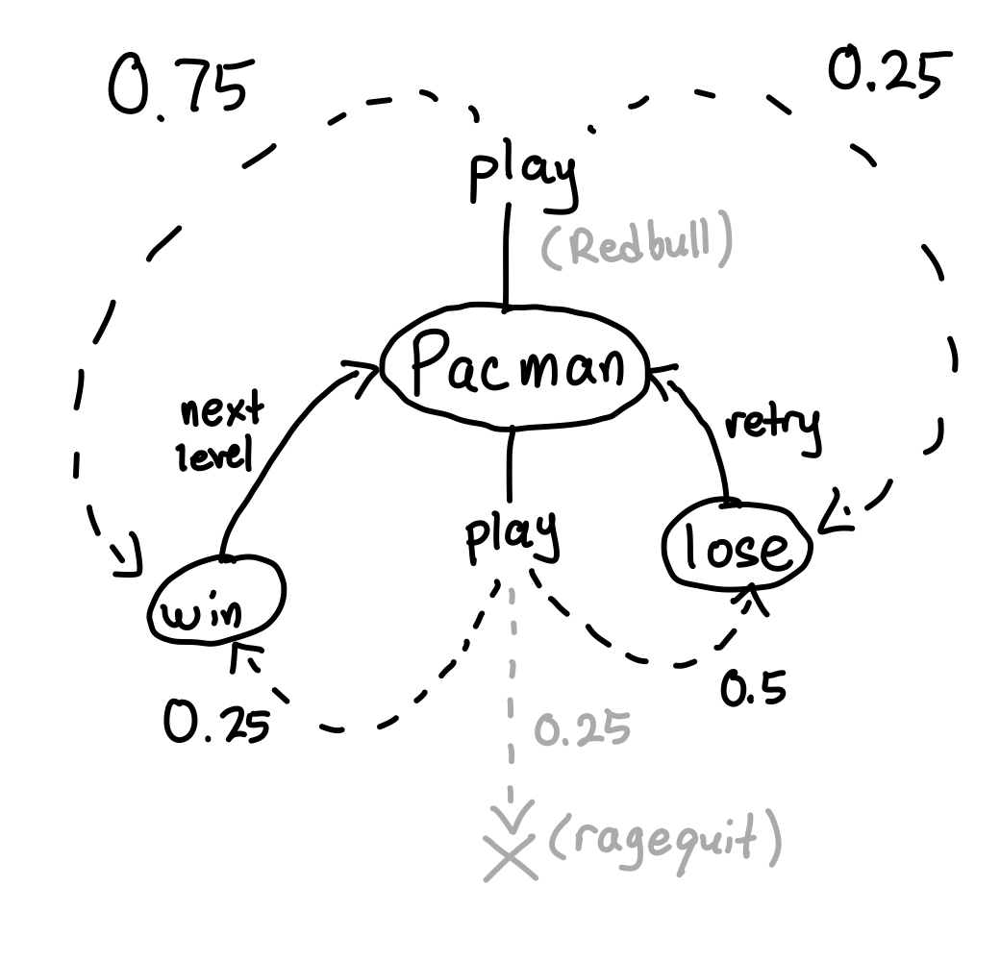
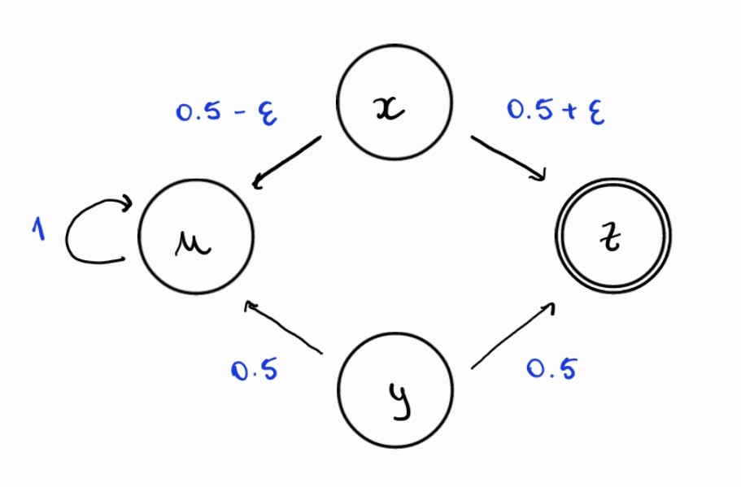
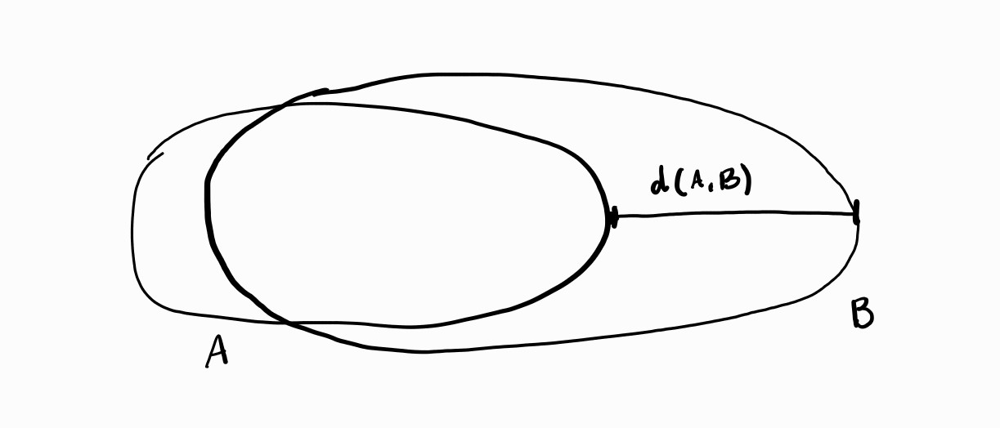
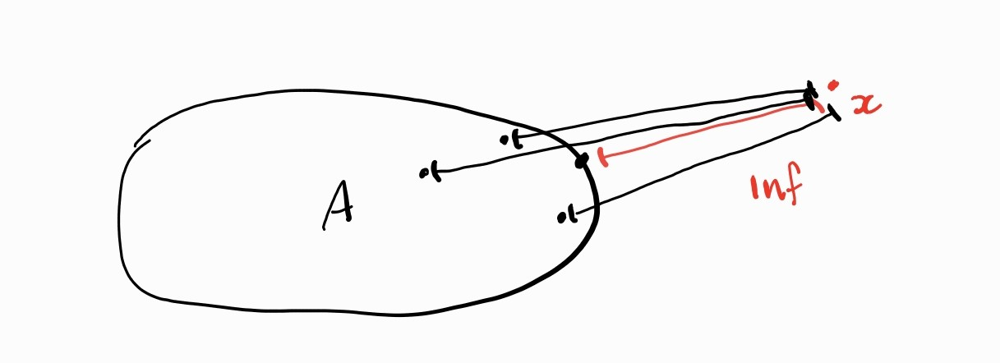
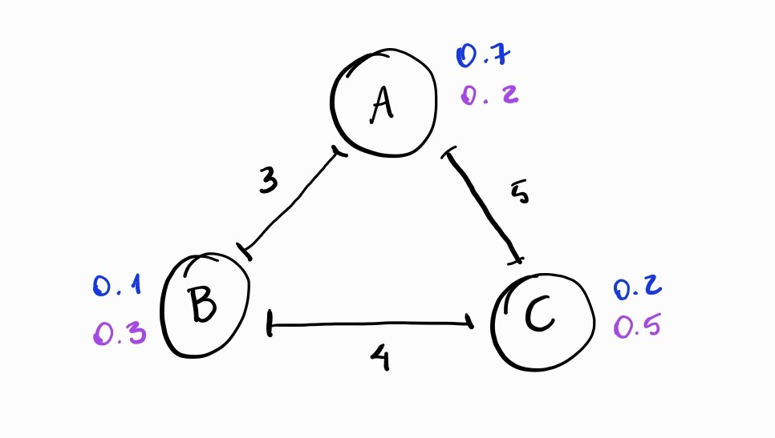

Remember the Pacman game from the blog post [TODO link to the blog by Alyssa and Max]? The authors applied a determinization procedure to it, but did not draw the resulting coalgebra. In this post, we introduce different algebraic presentations of monads that model nondeterminism and probability in order (among other niceties) to draw that determinized automaton. Determinization is the first step for computing equivalences of automata. In the second part of this blog, we go beyond equalities and define a distance between automata, without losing our previously defined
${Set}$-monads, nor their presentations.

**Algebraic presentations of monads for automata**

This blog post builds on the great post [TODO link to the blog by Alyssa and Max], and we advise reading it before proceeding. In that post, we learned how transition systems can be modeled as coalgebras $S \to F(S)$, with $S$ a set of states and $F$ a functor. We also encountered automata and a notion of equivalence between automata given by determinization followed by bisimulation. Recall that an automaton with $M$-effects, labels in $A$, and observations in $O$ is a coalgebra $S \to O \times (MS)^A$. Each transition is given a label from the set $A$, the set $O$ describes all the observations one can make about a state in $S$, and the functor $M$ gives some flavor to the transitions...

Consider for example the monad $\mathcal{C}$ of non-empty finitely generated convex sets of probability distributions. Intuitively, $\mathcal{C}$ models nondeterministic choice followed by probabilistic choice. For example, we can model Alyssa's Pacman game!

Rather than writing down unit and multiplication explicitly, we will use a *presentation* of $\mathcal{C}$: an algebraic theory $(\Sigma, E)$ such that $\mathcal{C}$ is isomorphic to the monad mapping sets of variables to $\Sigma$-terms modulo $E$. Intuitively, a presentation of $M$ is to algebras of $M$ what the theory of rings is to rings. The $M$-algebras are *models* of the presentation.

We will see that handling $\mathcal{C}$ via a presentation is very convenient. For instance, to determinize an automaton with $M$-effects and $O$-observations, we need an algebra $MO \to O$. A presentation tells us exactly what structure $O$ must carry! 

For $\mathcal{C}$, it was shown in [1] that this monad is presented by the theory of convex semilattices, whose signature
is made of a binary operation $\oplus$ (nondeterministic choice), and for each $p \in (0,1)$ a binary operation $+_p$ (probabilistic choice with probability $p$), and whose axioms are:
\[
\begin{aligned}
&\text{(A)} && x \oplus (y \oplus z) = (x \oplus y) \oplus z \\
&\text{(C)} && x \oplus y = y \oplus x \\
&\text{(I)} && x \oplus x = x \\
&\text{(A}_{q,p}\text{)} && (x +_q y) +_p z = x +_{pq} (y +_{\frac{1-q}{1-p}} z) \\
&\text{(C}_p\text{)} && x +_p y = y +_{1-p} x \\
&\text{(I}_p\text{)} && x +_p x = x \\
&\text{(D)} && x +_p (y \oplus z) = (x +_p y) \oplus (x +_p z)
\end{aligned}
\]

With a presentation of $\mathcal{C}$, we get a language to describe the new states of the determinization of a $\mathcal{C}$-automaton: each determinized state is a finite expression made of the original states and the operations in the signature like $\mathtt{Pacman}$ or $\mathtt{win} +_{3/4} \mathtt{lose}$. The presentation tells us how to compute the transitions:
For "simple" states like $\mathtt{Pacman}$, we just read from the automaton the expression corresponding to the right combination of nondeterminism and probability:
\[
\begin{array}{l}
     \mathtt{Pacman}\\
    \downarrow \mathtt{play}\\
    (\mathtt{win} +_{0.75} \mathtt{lose}) \oplus  ((\mathtt{win} +_{0.5} \star) +_{0.5} \mathtt{lose})
\end{array}
\]

For "complex" states like the one above, the theory of presentations tell us that every occurrence of simple states can be replaced by the complex state it transitions to, e.g.:
\[
\begin{array}{l}
    (\mathtt{win} +_{0.75} \mathtt{lose}) \oplus  ((\mathtt{win} +_{0.5} \star) +_{0.5} \mathtt{lose})\\
    \downarrow \mathtt{next\ level}\\
    (\mathtt{Pacman} +_{0.75} \star) \oplus  ((\mathtt{Pacman} +_{0.5} \star) +_{0.5} \star)
\end{array}
\]

Finally, we can use the equations of the presentation to simplify this expression a bit:
\[
\begin{array}{ll}
    (&\mathtt{Pacman} +_{0.75} \star) \oplus  ((\mathtt{Pacman} +_{0.5} \star) +_{0.5} \star)\\
    &= (\mathtt{Pacman} +_{0.75} \star) \oplus  (\mathtt{Pacman} +_{0.25} (\star +_{1} \star) & ({A}_{0.5, 0.5})\\
    &= (\mathtt{Pacman} +_{0.75} \star) \oplus (\mathtt{Pacman} +_{0.25} \star) & (\text{I})
\end{array}
\]

**Modeling termination**

The way we modeled ragequit and actions not applying on certain states using a terminal state $\star$ is a bit ad hoc, though. A more systematic way of modeling termination (e.g., a program returning or crashing) which also behaves better with more complex sets of observations, is to compose the monad $M$ modeling certain effects with the $+1$ termination monad, which acts on sets by adding a distinct element $\star$ representing termination. This yields a new monad $M(+1)$. Having a monad is useful: we can use the same automaton formalism, but with termination. 
For $\mathcal{C}$, this gives the monad $\mathcal{C}(+1)$ of non-empty finitely generated convex sets of *subdistributions*, i.e., a probability distribution whose total mass is less or equal to $1$ (instead of exactly $1$).

Interestingly, this monad is presented by the theory of *pointed* convex semilattices, i.e., we add an extra symbol $\star$ in the signature with no additional equations. 

However, there are different ways to model termination with the monad $\mathcal{C}$: for example, termination may be a nondeterministic alternative: a state either transitions to a non-terminating effectful state, or terminates outright. In our example, however, termination is probabilistic: some actions have a chance to lead to termination every time they are applied.

This is another point where algebraic presentations shine: it is easy to add additional axioms to the theory of pointed convex semilattices to refine the meaning of termination, and it again gives a presentation of some monad. However, there is not always a nice semantic description of these monads... Nevertheless, it does when adding either the bottom axiom $(\bot)$, or both $(\bot)$ and the black hole axiom $(BH)$!
$$\begin{aligned}
    &x \oplus \star = x\ (\bot) &x +_p \star = \star \mid p \in (0, 1)\ (BH)
\end{aligned}$$
The resulting monads are called $\mathcal{C}+1$ and $\mathcal{C}^\downarrow$.

**From equivalences to distances between automata**

Now here comes the best part: while equivalences of automata are nice, distance between programs are even nicer, and sometimes necessary to reason properly about programs with probability and nondeterminism! Our intuition tells us that programs that return the same output with high-probability should be closer than programs whose output are different almost all the times. Distances make this intuition formal by using quantities (usually real numbers) to represent how close/far programs are. We follow [3].

Consider for example the following transition system from Section 2 of [2], without labels, and with state space $X = \{u,x,y,z\}$, where $\varepsilon \in [0,0.5]$, $z$ is an accepting state and $u$ is a fail state, which once reached can never be left and the system loops indefinitely.

If we compare the behavior of $x$ and $y$, we see that they are not behaviorally equivalent. This is because in state $x$ there is always a bias towards the accepting state $z$ which is controlled by the value of $\varepsilon$. However, we would like to say that their behavioral distance is $\varepsilon$. If we took $\varepsilon = 0$, then they would really be behaviorally equivalent.
In the rest of this post, we will show how to formalize this notion of distance without losing the benefits of presentations!
To begin with, we will need to work with monads in ${1Met}$ rather than ${Set}$ in order to get a notion of distance.

**1-bounded metric spaces**

A **1-bounded metric space** is a pair $(X, d)$ with $X$ a set and $d \colon X \times X \to [0,1]$ such that $d(x, y) = 0$ if and only if $x = y, d(x, y) = d(y, x)$, and $d(x, y) \leq d(x, z) + d(z, y)$, for all $x, y, z \in X$. A function $f \colon X \to Y$ between two 1-bounded metric spaces $(X, d_X)$ and $(Y, d_Y)$ is **non-expansive** if $d_Y (f (x_1), f (x_2)) \leq d_X (x_1, x_2)$ for all $x_1, x_2 \in X$. We denote with ${1Met}$ the category of 1-bounded metric spaces and non-expansive maps.

We now need some ${1Met}$ monads to replace the ${Set}$-monads we used for effects. A solution is to lift ${Set}$ monads! Given an endofunctor $F \colon {Set} \to {Set}$, if we start with a metric space $(X,d)$, the idea is to endow $F(X)$ with a metric so we can define $\hat F \colon {1Met} \to {1Met}$ using the same actions on objects and arrows as $F$. Before applying this idea to $\mathcal{C}$, let's start by lifting the powerset and probability distribution monads $\mathcal{P}$ and $\mathcal{D}$, modeling respectively probability and nondeterminism.
Recall that $\mathcal{P}$ maps sets $X$ to their powerset $\mathcal{P} X$, while $\mathcal{D}$ maps $X$ to the set of finitely supported probability distributions on $X$.

**Lifting of $\mathcal{C}$.**

To lift the functor $\mathcal{P}$ to ${1Met}$ we need a notion of distances between subsets. Given a metric space $(X,d)$, we define a distance between $A, B \subseteq X$ using the metric $d$. The idea is to measure how far $A$ is from $B$ in $X$:

Intuitively, we want $A$ to be equal to $B$ if and only if this distance is equal to zero.
We start with the notion of distance between a point $x \in X$ and a subset $A \subseteq X$:

\[ d(A,x) = \inf\{d(x,y) : y \in A\} \]
and continue with the distance between two subsets $A,B \subseteq X$:

\[ d(A,B) = \sup\{d(A,x) : x \in B\} \]

Now, in order to ensure symmetry, we need to compare the distances $d(A,B)$ and $d(B,A)$, resulting exactly in the definition we wanted for the first image
\[ H(d)(A,B) = \max\{d(A,B),d(B,A)\} \]
$H(d)$ is known as the **Hausdorff lifting of $d$**.
Finally, one can prove that, starting with a 1-bounded metric space $(X,d)$, we have that $(\mathcal{P}(X),H(d))$ is also a 1-bounded metric space.

Now, for the functor $\mathcal{D}$ we need a more elaborated example in order to understand the intuition behind the lifting (we follow Section 2.1 of [2]).

Suppose you are the owner of three coffee roasting plants, $A,B$ and $C$, each with an adjacent café where one can taste the coffee. We let $X = \{A,B,C\}$ be the set of places and consider the distributions $P \colon X \to [0,1]$ and $Q \colon X \to [0,1]$ below to model supply and demand, respectively, of each product in proportion to the total supply or demand:

\[
\begin{array}{cccccccccc}
    & P \colon & X & \longrightarrow & [0,1] & & Q \colon & X & \longrightarrow & [0,1]\\
    \\
    & & A & \mapsto & 0.7 & & & A & \mapsto & 0.2 \\
    \\
    & & B & \mapsto & 0.1 & & & B & \mapsto & 0.3\\
    \\
    & & C & \mapsto & 0.2 & & & C & \mapsto & 0.5
\end{array}
\]
(For the sake of simplicity,
we assume that the total amount of production equals the amount of consumption.)

We have illustrated this situation graphically below. The numbers on the edges indicate the distance between the places $A$, $B$ and $C$ (the distance between a place and itself is $0$) whereas the numbers on the nodes indicate supply $P$ (upper value) and
demand $Q$ (lower value):

The goal is to find an economically motivated view of defining a distance between $P$ and $Q$ based on the notion of transportation which is studied extensively in transportation theory [4]. The leading idea is that the product needs to be transported so as to avoid excess supply and meet all demands.

Formally, we will have to define a function $t \colon X \times X \to [0, 1]$ where $t(x, y)$ describes (in %) the amount of goods to be transported from place $x$ to $y$ such that:
* supplies are used up: for all $x \in X$ we must have $\sum_{y \in X} t(x, y) = P (x)$;
* demand is satisfied: for all $y \in X$ we must have $\sum_{x\in X} t(x, y) = Q(y)$.

In probability theory, such a function is a joint probability distribution on $X \times X$ with marginals $P$ and $Q$ and is called a coupling of $P$ and $Q$. Here, we will call it a transportation plan for supply $P$ and demand $Q$ and write $T (P, Q)$ for the set of all such transportation plans.

Supposing the cost of transporting coffee from a place to another is directly proportional to the distance between the places, to minimize the costs we want to minimize $\sum_{x,y \in X} t(x,y) \cdot d(x,y)$ among all possible transportation plans. Having that in mind we define
\[ K(d)(P,Q) = \inf\{\sum_{x,y \in X} t(x,y) \cdot d(x,y) : t \in T (P, Q)\} \]

For a generic metric space $(X,d)$ and distributions $\varphi_1, \varphi_2 \in \mathcal{D}(X)$, we define
\[K(d)(\varphi_1,\varphi_2) = \inf_{t \in Coup(\varphi_1,\varphi_2)} (\sum_{(x_1,x_2) \in X \times X} t(x_1,x_2) \cdot d(x_1,x_2) )\]
where $Coup(\varphi_1, \varphi_2)$ is defined as the collection of couplings of $\varphi_1$ and $\varphi_2$, i.e., 
$$Coup(\varphi_1, \varphi_2) = \{t \in \mathcal{D}(X \times X) : \mathcal{D}(\pi_1)(t) = \varphi_1 \text{ and } \mathcal{D}(\pi_2)(t) = \varphi_2\}$$ where $\pi_1 : X_1 \times X_2 \to X_1$ and $\pi_2 : X_1 \times X_2 \to X_2$ are the projection functions. These are the generic equivalent of using all the supplies and satisfying all demands as exemplified above.
$K(d)$ is known as the **Kantorovich lifting of $d$**.
Starting with a 1-bounded metric space $(X,d)$, one can prove that $(\mathcal{D}(X),K(d))$ is also a 1-bounded metric space.

Since $\mathcal{C}(X) \subseteq \mathcal{P}\mathcal{D}(X)$ we can use these two liftings to define a distance function for $\mathcal{C}(X)$, that is we can show that $(C(X), HK(d))$ is a 1-bounded metric space. This gives us our desired ${1Met}$-monad $\hat{\mathcal{C}}$, which has the same action on arrows and same unit and multiplication as the monad $\mathcal{C}$.

**What about presentations?**

Now, the difference in considering program distances instead of program equivalence is expressed also algebraically. Instead of describing the axioms using equality "$=$", we use relations $a =_{\varepsilon} b$ which we think of as saying that "$a$ is equal to $b$ up to an error of $\varepsilon$".  

We replace equalities by quantitative inferences:
$$\{x_i =_{\varepsilon_i} y_i\}_{i\in I} \vdash s =_{\varepsilon} t$$ where $\varepsilon$, $\varepsilon_i \in [0,1]$ and $s, t$ are terms. 

A quantitative inference is satisfied in a quantitative algebra $(A, {f^A}_{f \in \Sigma},d)$, where the maps $f^A$ are non-expansive and $(A,d) \in {1Met}$, if, for all $x_i,y_i,s,t \in A$, we have:
\[ \text{if } d(x_i, y_i) \leq \varepsilon_i \text{ for all } i \in I, \text{ then } (s, t) \leq \varepsilon.\]

Similarly, we replace algebraic theories by quantitative equational theories.
For instance, the quantitative equational theory of convex semilattices has signature $\Sigma_CS = (\{\oplus\}\cup\{+_p\}_{p\in(0,1)})$ and is defined as the set of quantitative inferences derivable by the following axioms, stated for arbitrary $p, q \in (0, 1)$ and $\varepsilon_1, \varepsilon_2 \in [0, 1]$:
we substitute every axiom $A,C,I,A_p,C_p,I_p$ and $D$ in $\Th_{CS}$ by changing the usual equality "$=$" for the inference $ \emptyset \vdash $ with $=_0$
\[
\begin{aligned}
&\text{(A)} && \emptyset \vdash x \oplus (y \oplus z) =_{0} (x \oplus y) \oplus z \\
&\text{(C)} && \emptyset \vdash x \oplus y = y \oplus x \\
&\text{(I)} && \emptyset \vdash x \oplus x = x \\
&\text{(A}_p) && \emptyset \vdash (x +_q y) +_p z = x +_{pq} (y +_{\frac{1-q}{1-p}} z) \\
&\text{(C}_p) && \emptyset \vdash x +_p y = y +_{1-p} x \\
&\text{(I}_p) && \emptyset \vdash x +_p x = x \\
&\text{(D)} && \emptyset \vdash x +_p (y \oplus z) = (x +_p y) \oplus (x +_p z) \\
\end{aligned}
\]
and add the following quantitative inferences
\[
\begin{aligned}
&\text{(H)} && \{x_1 =_{\varepsilon_1} y_1, x_2 =_{\varepsilon_2} y_2\} \vdash x_1 \oplus x_2 =_{max(\varepsilon_1,\varepsilon_2)} y_1 \oplus y_2 \\
&\text{(K)} && \{x_1 =_{\varepsilon_1} y_1, x_2 =_{\varepsilon_2} y_2\} \vdash x_1 +_p x_2 =_{p \cdot \varepsilon_1 + (1-p) \cdot \varepsilon_2} y_1 +_p y_2 
\end{aligned}
\]

A model of a quantitative equational theories is then a quantitative algebra: a ${1Met}$ space $A$ with a non-expensive function for all symbols of the theory, such that for every inference $\{x_i =_{\varepsilon_i} y_i\}_{i\in I} \vdash s =_{\varepsilon} t$, and variables $x_i, y_i$ in $A$, if $d(x_i, y_i) \leq \varepsilon_i$ for all $i \in I$, then $d(s,t)\leq \varepsilon$ when we interpret the variables $x_i$ and $y_i$ by the corresponding points in $A$, and the symbols by the corresponding functions on $A$. See [5] for more details.

**Lifting termination.**

As in the ${Set}$ case, there is also a termination monad $+\hat 1$ that can be composed with any ${1Met}$ monad. We thus get a monad $\hat{\mathcal{C}} (+ \hat 1)$ for free.

$\hat{\mathcal{C}} (+\hat{1})$ is also nicely presented by the quantitative equational theory of *pointwise* convex semilattices, mirroring the ${Set}$-case! For the $\mathcal{C}^\downarrow$ monad, more work is needed to provide a semantic description of the ${1Met}$-monad $\hat{\mathcal{C}^\downarrow}$ presented by quantitative equational theory of pointed convex semilattices with the additional quantitative inference 
\[
\begin{aligned}
&(\bot_\text{Q}) && \emptyset \vdash x \oplus \star =_0 x. 
\end{aligned}
\]
As for the $\mathcal{C}+1$ monad, however, if we also add the quantitative inference
\[
\begin{aligned}
&(\text{BH}_\text{Q}) && \emptyset \vdash x+_p \star =_0 \star 
\end{aligned}
\]
for $p \in (0,1)$, then the result theory collapses: the quantitative $\emptyset \vdash x =_0 y$ is derivable, i.e. the underlying metric space is a point!

[1] The Theory of Traces for Systems with Nondeterminism, Probability, and Termination, by Filippo Bonchi, Ana Sokolova, and Valeria Vignudelli

[2] Coalgebraic Behavioral Metrics, by Paolo Baldan, Filippo Bonchi, Henning Kerstan and Barbara König

[3] Combining Nondeterminism, Probability, and
Termination: Equational and Metric Reasoning, by Matteo Mio, Ralph Sarkis and Valeria Vignudelli

[4] Optimal Transport – Old and New, by Cédric Villani

[5] Quantitative Algebraic Reasoning, by Radu Mardare, Prakash Panangaden and Gordon D. Plotkin
